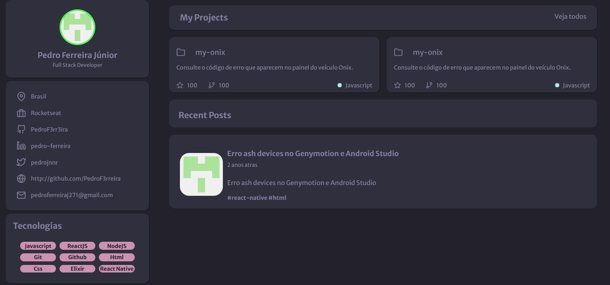

<h1 align="center">Desafio "Portfolio"</h1>

 

    <a href="#tecnologias">Tecnologias</a> •
    <a href="#projeto">Projeto</a> •
    <a href="#layout">Layout</a>

## Tecnologias

---
Esse projeto foi com:

- HTML
- CSS

## Projeto

---

O projeto foi feito seguindo as regras do desafio "Portfolio" da <a href="https://github.com/Rocketseat">Rocketseat</a>, sendo uma página simples e estática com algumas informações pessoais do github.

## Layout

---

Você pode clicar <a href="https://www.figma.com/file/L6fCiWtOgXCfslQdezqQeF/DD-%2F-Portfolio/duplicate?node-id=3%3A2">aqui</a> para poder visualizar o layout da página no figma. É necessário ter uma conta para acessá-lo.
